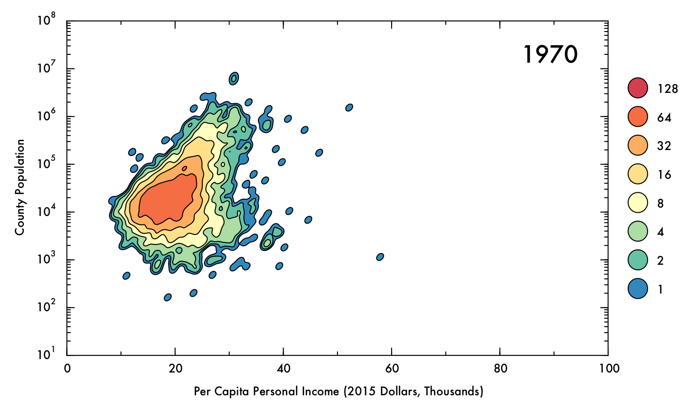
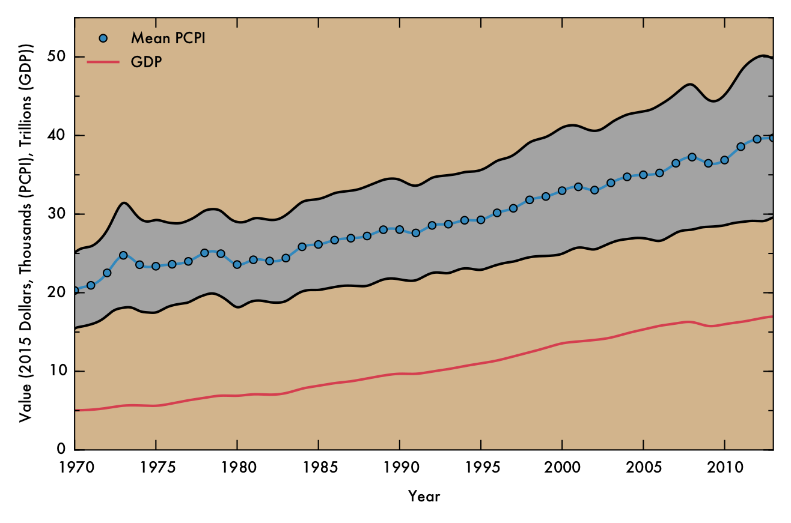
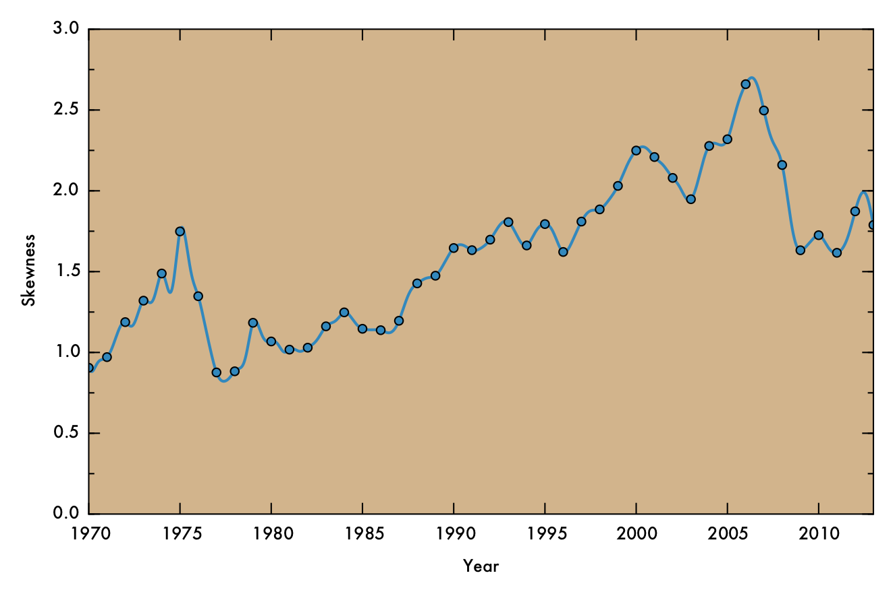
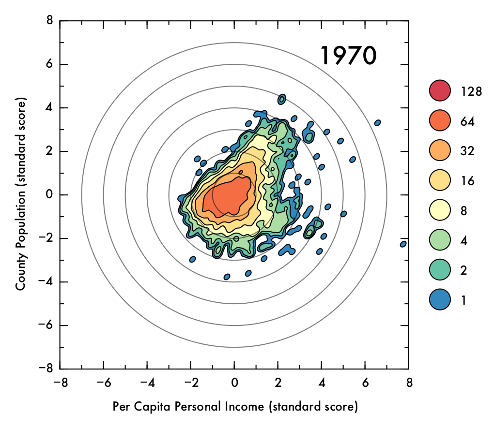

# PCPI-vs-POP

*Click image for high-definition, interpolated, 30 fps version!*

### How has the US economy changed over time?

To investigate this question (and to motivate myself to learn Pandas, the data processing and analysis library for Python), I sought to visualize economic data from the massive [Federal Reserve Economic Data (FRED)](https://research.stlouisfed.org/fred2/) database. Specifically, I compared [per capita personal income (PCPI)](https://en.wikipedia.org/wiki/Per_capita_income) and population of all counties (or equivalents, e.g. borough or unincorporated town) in the US. These metrics were selected on the assumption that, when combined, they would demonstrate how general prosperity has changed over time for the nation as a whole, and how the distribution of these changes manifested for individual localities.

### Methodology

The entire FRED database (as a collection of csv files) was downloaded [here](https://research.stlouisfed.org/fred2/downloaddata/). During analysis, individual counties were identified with unique five-digit Federal Information Processing Standard (FIPS) codes, obtained from [US Census data](https://www.census.gov/geo/reference/codes/cou.html). In the FRED database, both PCPI and population data for counties are given in annual frequency. PCPI data is available (in the majority of cases) between 1969 and 2013, whereas population data is available from 1970 to 2014. The following analysis covers the largest interval of overlap (1970 to 2013). PCPI and population data for each county was aggregated from the raw FRED data into Pandas DataFrame objects. Of the 3,143 counties (or equivalents) in all 50 states and DC, 3,049 had complete data over the time range considered and were used in further analysis.

To enable comparison across time, the monetary unit of PCPI was adjusted to 2015 Dollars by using the [Consumer Price Index](https://research.stlouisfed.org/fred2/series/CPIAUCSL), a commonly-used basis for adjusting for inflation. The logarithm of population data was taken, which was necessary to compensate for the extreme variation in population across counties.

Correlation was assessed using [Spearman's rho correlation coefficient](https://en.wikipedia.org/wiki/Spearman%27s_rank_correlation_coefficient). This metric was selected because it quantifies monotonicity in the relationship between the two data sets, and imposes no assumptions on the shape of the dependency (i.e. it is non-parametric). Additionally, it is less sensitive to outliers than the linear correlation coefficient, making it more suitable to the data in this case.

The data showed some a high degree of variety in density, with a tightly packed core but disperse edges. This presented a challenge in visualization; a simple scatter plot would not effectively convey the degree of density in the central areas, and a histogram might distort the shape of the distribution and would not preserve an accurate representation of the positions of outlying data points. To intuitively demonstrate the positions of outliers as well as the density and shape of the distribution, a Gaussian [kernel density estimation](https://en.wikipedia.org/wiki/Kernel_density_estimation) (KDE) was utilized. In this process, each data point is represented by a single two-dimensional Gaussian function (or kernel), which is centered on the data point and has a size and shape derived from the covariance matrix of the data (or more precisely, the [Mahalanobis distance](https://en.wikipedia.org/wiki/Mahalanobis_distance)). The probability density function is approximated by summing the kernels from each data point. In this case bandwidths that were smaller than the recommended benchmarks were used to prevent over-smoothing, thus the final result is to be considered more of a visual aid than a probability density approximation. The levels which define the contour plots were selected such that the lowest level could represent an outlying data point (60% of the maximum value of a single kernel), with higher levels corresponding to increasing powers of two multiplied by this value. The image below demonstrates the effect of the KDE calculation on single data points (shown as semi-transparent black dots). The individual kernels (at a fixed contour level) take on an elliptical shape. Where the data is dense, the kernels create a blob that mimics the shape of the underlying data, and reports on the density of points underneath.

One of the main advantages of the KDE method is that there are no external parameters. For this case in particular, in which the distribution and spread of the data varies substantially over time, this sort of non-parametric approach can more accurately demonstrate the shape of the data than parametric approaches such as histograms.

In order to better illustrate the changes over time, the data was interpolated to increase the sampling rate artificially by a factor of 15. The resulting [video](https://vimeo.com/143492324) depicts the data at 30 fps (2 years per second). Cubic spline interpolation was used, resulting in data that appears to move with gradually changing velocity, rather than suddenly redirecting from year to year as would be the case with linear interpolation.

The KDE calculation and plotting is relatively computationally intense, so to facilitate the rendering process individual frames were rendered in parallel processes, which for the machine that carried out the analysis described here enabled a 15-fold decrease in rendering time (16 CPUs, with one left free for system use, following convention).

All processing, analysis, and visualization was done in Python using open-source libraries. The bulk of data handling and analysis was done with Pandas, and all plotting was done with Matplotlib. A typical work flow for this analysis is demonstrated in the `if __name__ == '__main__':` portion in the analysis.py file. Additionally, an ipython notebook demonstration is provided.

### Results and Interpretation

The following gif displays the result of the analysis described above over the entire interval from 1970 to 2013. Each frame represents a single year (denoted in the upper right corner). In the upper left corner, Spearman's rho correlation coefficient for PCPI and population is displayed, as is the mean and skewness for the PCPI data. The lower region of the plot contains the 5 highest- and lowest-earning counties for each year.

*Click image for high-definition, interpolated, 30 fps version!*

##### Overall Increase

Perhaps the most obvious conclusion from this analysis is that, overall, mean income has risen substantially (nearly doubling) over time, despite the correction for inflation. However, this does not necessarily entail that the population as a whole has seen improvements in their economic situations, as PCPI is a mean value and thus can be distorted by a small proportion of people earning significantly more than their peers. Nonetheless, the fact that the mean income has nearly doubled for the nation as whole, even including the poorest counties (where the effect of income inequality might be less severe), suggests that the average American is more prosperous in current times than they were previously. Indeed, the trend in increasing mean PCPI mirrors the growth of GDP (plotted below), suggesting that increase in PCPI overall is at least partially due to real economic growth, and not just rising income inequality.

In the above plot, national mean PCPI is plotted in blue, with markers denoting data points derived directly from raw FRED data and a solid line indicating cubic spline interpolated points. The gray shaded area represents the mean PCPI value plus or minus the standard deviation in PCPI at that point. The red line represents GDP, normalized to 2015 dollars using [GDP implicit price deflator values](https://research.stlouisfed.org/fred2/series/GDPDEF).

##### Correlation

Through most of the period considered, there exists some degree of correlation between population and PCPI. This makes sense, given that industries that have steady, high-paying jobs (such as law, finance, and medicine) are often localized in places of at least moderate population density. Additionally, cities often have higher cost of living than rural areas, and therefore incomes are (ideally) increased accordingly.

However, by 2013 this general trend has mostly vanished, with Spearman's rho falling to just 0.04. This situation also occurred briefly in the early 1970's. In both cases, a prong of counties with low population juts out in PCPI. This observation may be of some concern, because it could indicate that high-paying jobs are becoming concentrated in low-population areas, where less people are able to benefit from the opportunities. On the other hand, this behavior could be a benign consequence of rapid but localized economic changes, such as the recent and ongoing oil boom in North Dakota, or simply due to an inherent higher susceptibility to fluctuations involved with having a smaller population (e.g. Sully County, SD, which has a population just over 1,400). Indeed, the pronounced fluctuations for lower-population counties are readily apparent when the data has been [interpolated over time](https://vimeo.com/143492324).

##### Skewness

The skewness in PCPI fluctuates over time, but in general is higher in recent times than it has been previously (see plot below). The two regions that correspond to substantial, sustained decrease in skewness (around 1975 and 2007) also roughly correspond to periods of recession. This association makes sense, since a general decrease in the strength of the US economy could logically result in curtailing of income across all demographics, but especially among those whose previous earning simply cannot be sustained in the poorer economic climate. Therefore, recession might have an equalizing effect on income disparity.

In the above plot, markers denote data points derived directly from raw FRED data and the solid line indicating cubic spline interpolated points (as in the previous plot). 

Below, the standard score (or z score) for the data is shown as a gif that shows the transitions throughout time. Visualizing the standard scores facilitates assessment of the shape of the distribution, as it eliminate changes to the overall mean position and normalizes the spread in the data. From this representation, it is clear that the directionality of the relationship between population and PCPI has greatly diminished in recent years. Additionally, the peak of the distribution is below the mean (though mostly within one combined standard deviation in both variables, represented as concentric circles).

*Click image for high-definition, interpolated, 30 fps version!*

##### NYC in Detail
New York County is an interesting case for me, since it has consistently been among the highest-earning counties (and often *is* the highest-earning county) for the duration of the time analyzed, and also happens to be the city that I currently live in. PCPI data for New York County, as well as 7 surrounding counties (including the other four boroughs) and the national average as shown in the plot below. The increases in income in New York County (Manhattan) apparently does not correspond to similar growth for the other four boroughs, which mostly track with the national average. Westchester and Nassau counties, on the other hand, do seem to share in some element of New York County's growth. One possible theory to account for this result is that these counties house many people who commute to Manhattan, often for high paying jobs in areas such as finance or law. Thus, increasing incomes for those who work in Manhattan can have effects in these neighboring communities.

As in previous plots, the markers denote data points derived directly from raw FRED data and the solid line indicating cubic spline interpolated points.

### Sources

The base list of US Counties is taken from [2010 US Census data](https://www.census.gov/geo/reference/codes/cou.html).

All other raw data comes from the [FRED database](https://research.stlouisfed.org/fred2/). Specifically, this data was taken from the version of the database that was uploaded on October 17th, 2015. The county-wide population data within FRED is sourced from the US Bureau of the Census. The FRED PCPI data originated from the US Bureau of Economic Analysis.

